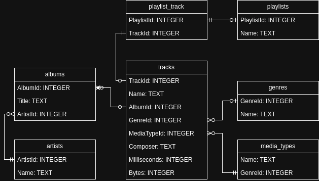

# AwesomeMusicAPI

This is the repository for Gabin BERNARD's R5.05 REST API Project.

## Install project

Before setting up the API, you should have NodeJS 20 (LTS) or higher installed on your system. To install and run the server, run the following commands in your terminal:

```bash
npm i               # Install dependencies
npm run start       # Run server on port 3000
```

Then you can access the API and its reference using the following links

- **API Root** - [http://localhost:3000/](http://localhost:3000/) 
- **Swagger UI Client** - [http://localhost:3000/reference](http://localhost:3000/reference)

## Dataset

### Browse data

This project includes sqlite3 prebuilt binaries for Linux inside the `/sqlite` folder. You can explore the dataset using the following command:

```bash
npm run sqlite
```

### Schema

We will use [this SQLite database](https://www.sqlitetutorial.net/sqlite-sample-database/) from [sqlitetutorial.net](https://www.sqlitetutorial.net/). The schema for this database is given below:


For this project, we'll only be using the following entities:



## Specification

The API should expose the following information:
- Project name
- Project description
- API Version
- Company name
- Company address
- Company owner

The API should also include the following entities and corresponding endpoints:

### Track

A track must have ***an id***, ***a name***, ***an album***, ***a genre***, ***a media type***, ***a composer***, ***a length (in milliseconds)*** and ***a file size (in bytes)***. The API should enable the user to:
- **Get** all (or n) tracks
- **Get** a track by its id
- **Get** the album of this track
- **Get** the media type of this track
- **Get** the genre of this track
- **Get** the list of playlists containing the track
- **Post**, **Edit** and **Delete** this track

### Album

An album must have ***an id***, ***a name***, ***an artist*** and ***a list of tracks***. The API should enable the user to:
- **Get** all (or n) albums
- **Get** an album by its id
- **Get** an album's artist
- **Get** the list of tracks in this album
- **Post**, **Edit** or **Delete** an album

### Artist

A playlist must have ***an id***, ***a name*** and ***a list of albums***. The API should enable the user to:
- **Get** all (or a number) of artists
- **Get** an artist name based on its id
- **Get** a list of albums made by this artists
- **Post**, **Edit** and **Delete** an artist

### Playlist

A playlist must have ***an id***, ***a name*** and ***a list of tracks***. The API should enable the user to:
- **Get** all (or a number) of playlists
- **Get** a playlist name based on its id
- **Get** a list of tracks included in a playlist based on its id
- **Post**, **Edit** and **Delete** a playlist
- **Post** and **Delete** a playlist track (add a track to a playlist)

### Media Type

A media type must have ***an id*** and ***a name***. The API should enable the user to:
- **Get** all (or a number) of media types
- **Get** a media type name based on its id
- **Get** all tracks having this media type
- **Post**, **Edit** and **Delete** a media type

### Genre

A genre must have ***an id*** and ***a name***. The API should enable the user to:
- **Get** all (or a number) of genres
- **Get** a genre name based on its id
- **Get** all tracks having this genre id
- **Post**, **Edit** and **Delete** a genre